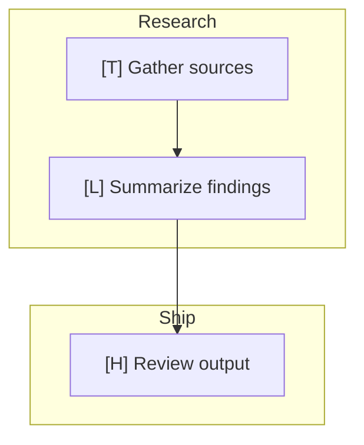

# Hyperstruck plans management

Inspect prior plans captured by Hyperstruck so you can reuse successful decompositions,
compare strategies across agents, and review the candidate learnings attached to each plan.

## Current environment

```!
echo "HYPER_BASE_URL=${HYPER_BASE_URL:-https://api.core.hyperstruck.com}"
echo "HYPER_AGENT_ID=${HYPER_AGENT_ID:-<not set>}"
echo "HYPER_API_KEY_SET=$([ -n \"$HYPER_API_KEY\" ] && echo yes || echo no)"
if [ -f .env ]; then echo "dotenv=found (.env)"; else echo "dotenv=not found"; fi
```

If `HYPER_API_KEY_SET=no` above, check `.env` for a `HYPER_API_KEY=` line. If still missing, stop and ask the user to set `HYPER_API_KEY`.

---

## Configuration

- Base URL: `HYPER_BASE_URL` from above, default `https://api.core.hyperstruck.com`
- API key: resolved above; never echo it
- Agent ID: use `HYPER_AGENT_ID` unless the user supplies `--agents`

Headers:

```
Authorization: Bearer <API_KEY>
Content-Type: application/json
Accept: application/json
```

---

## Commands

### `/hyper-plans search <query>`

Single-agent search:

```
GET {BASE_URL}/agents/{agent_id}/plans/similar?q=<query>&limit=10
```

Multi-agent search:

```
POST {BASE_URL}/plans/similar
```

```json
{
  "agent_ids": ["<uuid>", "<uuid>"],
  "q": "<query>",
  "limit": 10
}
```

If the user supplies `--agents <id1,id2,...>`, call the multi-agent endpoint. Otherwise call the single-agent route.

Summarize each hit with:

- `plan.plan_id`
- `plan.goal`
- `plan.summary` when present
- `similarity_score`
- top candidate learnings with `trust_level`

Also mention `partial_failures` when present.

### `/hyper-plans show <plan_id>`

Fetch:

```
GET {BASE_URL}/agents/{agent_id}/plans/{plan_id}
```

Then render:

1. A short text summary with goal, success/failure, number of steps, and reasoning.
2. A mermaid `flowchart TD` using:
   - one `subgraph` per milestone,
   - one node per step,
   - edges for `depends_on`,
   - shortened labels (`description` trimmed to a readable length),
   - step prefixes:
     - `[T]` tool_call
     - `[L]` llm_generation
     - `[H]` human_input
   - failed/degraded items marked in the label text, e.g. `(FAILED)` or `(DEGRADED)`

Example template:



If there are no milestones, render steps in a single default subgraph.

### `/hyper-plans learnings <plan_id>`

Fetch:

```
GET {BASE_URL}/agents/{agent_id}/plans/{plan_id}/learnings
```

List each candidate learning with:

- `learning_id`
- `content`
- `score`
- `trust_level`

---

## Error handling

- `401/403`: invalid key, missing scope, or unauthorized agent ids
- `404`: plan not found for an accessible agent
- `503`: plan runtime unavailable
- Network error: retry once after 3 s, then report failure

For detailed response shapes, see [reference.md](reference.md).
